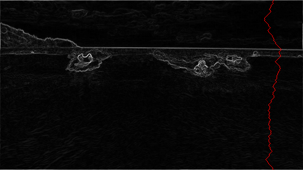

# Seam carving

## Описание
**Seam carving** — это алгоритм для изменения размера изображения, который сохраняет важные элементы и удаляет менее значимые. Если смотреть на изображение как на таблицу из пикселей, то на каждой итерации данного алгоритма удаляется только один пиксель из колонки (или ряда).

Если переводить дословно, то “seam carving” это “резьба по шву”. Вертикальным “швом” изображения называется последовательность связанных пикселей от верхнего ряда до нижнего, где в каждом ряду только один пиксель. Аналогично, горизонтальным “швом” называется последовательность связанных пикселе от крайней левой колонки до крайней правой, где в каждой колонке только один пиксель.

Возьмем фотографию 505-на-287 пикселей и изменим ее, используя алгоритм *seam carving*.

До:

После:

После того, как алгоритм закончил работу, было убрано 150 вертикальных последовательностей пикселей, что помогло уменьшить изображение на *30%*. Стоит отметить, что в отличие от стандартных подходов, где изображение бы кадрировали или масштабировали с потерей пропорций, *seam carving* оставил набор важных объектов на фотографии нетронутыми. Алгоритм *seam carving* активно используется в современных графических редакторах.

## Задание
Вам потребуется создать структуру данных, которая будет изменять размер изображения (WxH), использую алгоритм *seam carving*.

### Обозначения
Пиксель *(x,y)* в исходном изображении соответствует ячейке в таблице с колокой *x* и строкой *y*. Таким образом, пиксель *(0,0)* находится в левом верхний углу таблицы, а пиксель *(W-1, H-1)* в правом нижнем углу таблицы.

Пример таблицы 3x4:

Для описания каждого пикселя изображения используются три числа от 0 до 255.

### Алгоритм
1. На первом шаге потребуется вычислить энергию кажого пикселя. Энергия поможет определить, насколько важен пиксель. Пиксели с низкой энергией с большей вероятностью попадут в последовательность пикселей, которая будет удалена. Ниже представлена карта энергий для изображения:
   
   

   Светлые пиксели — пиксели с высокой энергией. 

2. На втором этапе потребуется определить вертикальную последовательность пикселей с минимальной суммарной энергией. Данная задача похожа на задачу нахождения кратчайшего пути в взвешенном графе, но есть важные отличия:
   1. Веса находятся в вершинах, а не на ребрах.
   2. Кратчайший путь нужно найти среди любых *W* пикселей в верхнем ряду к любым *W* пикселям в нижнем ряду.
   3. Граф ациклический. Для пикселя *(x,y)* есть ребра только в *(x-1, y+1)*, *(x, y +1)*, *(x + 1, y + 1)*.
   
   
3. После того, как последовательность с минимальной суммарной энергией найдена, пиксели, входящие в нее, нужно будет удалить из изображения.

### Вычисления
Для вычисления энергии пикселя используется следующая формула:

где

 это разность между компонентами пикселей *(x + 1, y)* и *(x - 1, y)*, отвечающими за красный цвет. Аналогично определяются  и  отвечающие за разность зеленых и голубых компонент соответственно.

